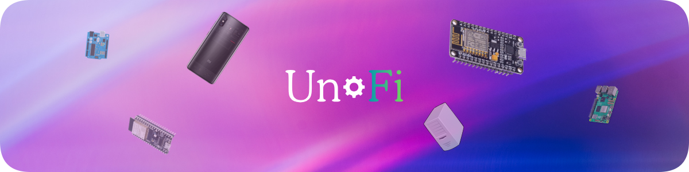

# UnFi 🚀

**UnFi** — your next-generation bootloader and system logger, built for creators, engineers, and tinkerers who demand *speed, reliability, and style*.  
Designed by **Sliz®**, UnFi transforms the way your microcontrollers start up — from a simple boot to a smart, self-aware initialization process.

---

## 🌟 Overview

UnFi (Universal Firmware Interface) is a **cross-platform, modular, and secure bootloader** for embedded devices.  
It’s fast, compact, and optimized for instant startup, diagnostics, and logging.

Built for:
- **Arduino Boards** — Uno, Nano, Mega, Leonardo, Due, and more  
- **ESP Series** — ESP32 (WROOM, S3, etc.) and ESP8266 (NodeMCU, Wemos D1 Mini, etc.)  
- **Future Platforms** — Raspberry Pi Pico, STM32, and custom SoCs (in development)  

UnFi ensures your device starts fast, verifies its environment, logs every action, and continues to run flawlessly — all with a minimal flash footprint.

---

## ✨ Features

| Feature | Description |
|----------|-------------|
| ⚡ **Lightning-Fast Boot** | Boots your firmware in milliseconds — up to **70% faster** than stock bootloaders. |
| 🔒 **Secure Start** | Built-in integrity and error handling to keep your firmware safe during launch. |
| 🧠 **Self-Diagnostics** | Every boot cycle performs a smart hardware scan and system validation. |
| 🧩 **Modular Design** | Works across Arduino, ESP32, and ESP8266 with a unified structure. |
| 🌐 **Universal Compatibility** | Extend UnFi to your own devices with minimal configuration. |
| 📦 **Tiny Footprint** | Consumes less than **4KB** of flash memory. |
| 🌀 **Endless Loop System** | Keeps your system running in a stable, continuous cycle. |

---

## ⚙️ Getting Started

Follow these steps to get UnFi running on your board:

### 1️⃣ Download or Clone the Repository
You can either:
- Clone it using Git:  
  ```bash
  git clone https://github.com/SlizR/UnFi.git
````

* Or download the ZIP directly from GitHub and extract it.

---

### 2️⃣ Explore the `UnFi/` Folder Structure

Inside the main directory, you’ll find organized subfolders for each supported platform:

```
UnFi/
 ├─ Arduino/
 │   ├─ Uno/
 │   │   └─ boot.ino
 │   ├─ Mega/
 │   │   └─ boot.ino
 │   ├─ Nano/
 │   │   └─ boot.ino
 │   ├─ ...
 │
 └─ ESP/
       ├─ ESP32_WROOM/
       │   └─ boot.ino
       └─ ESP8266_NodeMCU/
             └─ boot.ino
```

Each folder represents a **device-specific implementation** of the UnFi bootloader.

---

### 3️⃣ Select Your Device

Choose your board family:

#### 🟦 Arduino

1. Go to `UnFi/Arduino/`
2. Select your board (e.g. `Uno/`, `Mega/`, `Nano/`)
3. Open `boot.ino` in **Arduino IDE** or **VS Code + PlatformIO**
4. Under **Tools → Board**, select your device model
5. Click **Upload**

#### 🟩 ESP Devices

1. Go to `UnFi/ESP/`
2. Select:

   * `ESP32_WROOM/` for ESP32 boards
   * `ESP8266_NodeMCU/` for NodeMCU or Wemos boards
3. Open `boot.ino`
4. In Arduino IDE:

   * Select **Tools → Board → ESP32 Dev Module** or **NodeMCU 1.0**
   * Choose the correct **Port**
   * Click **Upload**

Once uploaded, open the **Serial Monitor** (115200 baud).
You should see this startup log:

```
[UnFi] Bootloader started.
[UnFi] Performing system checks...
[UnFi] System OK.
[UnFi] Bootloader completed.
```

If you see this — congrats 🎉 — your UnFi bootloader is alive and running!

---

### 4️⃣ Customize Your Boot Sequence

UnFi gives you two user functions for your own logic:

```cpp
void userSetup() {
  // Your setup logic here (WiFi init, sensors, etc.)
}

void userLoop() {
  // Your main loop here
}
```

Your custom logic runs *after* the UnFi boot process completes.
Errors in either phase are caught, logged, and signaled via LED blinking.

---

### 5️⃣ For Custom Boards

Not using a standard board? No problem.

1. Copy the closest template folder (`Uno/` for AVR, `ESP32_WROOM/` for ESP32, etc.)
2. Rename it to your device name:

   ```
   UnFi/MyCustomBoard/
   ```
3. Edit the header in `boot.ino`:

   ```cpp
   /*
     UnFi Bootloader / Logger by Sliz®
     MyCustomBoard
     Version 1.start.up
   */
   ```
4. Update your LED pin:

   ```cpp
   #define LED_STATUS <your LED pin>
   ```

Now UnFi runs perfectly on your custom board too 🚀

---

## 🎬 Website

Check out the official **UnFi Website**:
👉 [https://unfi.pp.ua](https://unfi.pp.ua)

There you’ll find live demos, visuals, and updates about upcoming releases.

---

## 🎫 Wiki

Visit the full **UnFi Wiki** for:

* Board-specific setup guides
* Example sketches
* Troubleshooting
* Advanced features and configuration

📖 [Open UnFi Wiki →](https://github.com/SlizR/UnFi/wiki)

---

## 🤝 Issues

Want to help make UnFi better?

1. Open a [issues](https://github.com/SlizR/UnFi/issues)
2. Select what exactly you want to report, for example: error, bug, add, remove, etc.
3. Write in detail about what and what exactly and what is what, if everything is clear or unclear, we will let you know
4. Wait for a response from support

---

## 🧩 Roadmap

✅ **v1.start.up**

* Core bootloader
* Logging & diagnostics
* Arduino + ESP support

🚧 **v0.1**

* Web dashboard
* Flash recovery system
* Smart boot analytics

---

## 💖 Credits

Crafted with precision and speed by **Sliz®**.
Because your device deserves a *smart start*.

> *“UnFi — Born fast. Built smart.”*
